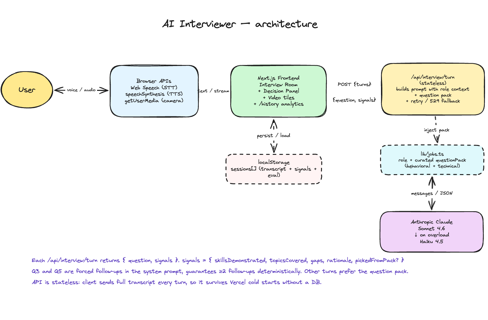

# AI Interviewer

A lightweight web app where you pick a job and run a voice-driven interview with an AI interviewer. The interviewer adapts every question to your previous answer, keeps live track of which skills you've shown vs. which gaps remain, reads its questions out loud, and produces a structured evaluation at the end.

Built for the AfterQuery LatAM take-home. Target time was 4 hours; this is what fit in that window — including all four stretch goals.

> **Live demo:**

---

## Architecture at a glance



The whole thing is one Next.js app. The API layer is intentionally stateless — the client owns the session and posts the full transcript on every turn. That keeps it cheap to host (no DB, no Redis) and means the same code runs identically on `localhost` and on Vercel's serverless runtime.

---

## What's in the box

Covers every requirement from the spec, plus all four stretch goals.

### Core

- **Job picker** — three sample roles (Senior Backend, ML Platform, Founding Product Engineer), each with a short description, on a vertical editorial-style home page.
- **Interview Room** — voice-first UI with a big mic button (Web Speech API for STT), a keyboard fallback for browsers that don't ship the Speech API, and a video-call layout when the camera is enabled.
- **TTS interviewer** — every question is read aloud via the browser's `speechSynthesis`. Mute toggle persists across sessions.
- **Adaptive interviewer** — exactly 6 questions per session. Questions 3 and 5 are forced follow-ups in the system prompt, so the spec's "≥2 follow-ups" requirement is guaranteed deterministically rather than left to the model to self-count.
- **Role-grounded questions** — the system prompt is built per-role from the job's title, focus areas, longer description, and a curated question pack.
- **Session results page** — full transcript (Q/A turns) plus a structured evaluation (`strengths`, `concerns`, `overallScore`, `summary`).

### Stretch #1 — Decision panel

Every turn, the interviewer also returns a structured `signals` object:

```ts
{
  question: string,
  signals: {
    skillsDemonstrated: string[],   // cumulative
    topicsCovered: string[],        // cumulative
    gaps: string[],                 // what the interviewer still wants to probe
    rationale: string,              // why this question, now
    pickedFromPack?: { category: "behavioral" | "technical", question: string }
  }
}
```

The interview room renders this live in a sidebar — "Why this question", "Skills detected", "Topics covered", "Open gaps", and a violet "From pack" tag when a pack question was used. On the results page, every interviewer turn has an expandable "Why this question" line so you can audit the model's reasoning post-mortem.

### Stretch #2 — Job-specific question packs

Each job ships with a curated `questionPack` of 4 behavioral + 4 technical questions tailored to the role (e.g. distributed systems debugging for the Backend role, feature-store design for ML Platform, scrappy MVP trade-offs for Founding Product). The system prompt:

- On non-followup turns (Q1/Q2/Q4/Q6): tells the model to **prefer pulling from the pack**, rephrasing as needed, but allowing improvisation if nothing in the pack fits the unexplored ground.
- On forced follow-up turns (Q3/Q5): tells the model to **ignore the pack** and dig into the candidate's last answer.
- If the candidate's previous answer was clearly thin (one-liner, "I don't know", off-topic), the prompt instructs the model to re-approach the same area from a different angle instead of burning a fresh pack question.

### Stretch #3 — Video mode

A "video call" layout with two tiles above the question card:

- **Interviewer tile**: an animated abstract avatar (gradient circle with "AI" mono text) that pulses concentric rings whenever the TTS is speaking. No fake video — explicitly abstract to avoid uncanny-valley territory.
- **Candidate tile**: native `<video>` with the local stream via `getUserMedia`, mirrored to feel like a webcam preview. Off by default — toggled with a single click.

Voice still drives the interview; the camera is purely a UI layer per the spec.

### Stretch #4 — Replay + analytics

A `/history` page that lists all past sessions stored in `localStorage` with:

- **Aggregate stats**: total sessions, average score (color-coded), and a tiny inline SVG sparkline showing score trend over time.
- **Filter chips**: per-role filter auto-derived from the sessions present.
- **Per-session row**: duration, question count, distinct topic coverage, talk-ratio bar (% of total characters spoken by the candidate), and the overall score.
- **"Replay"**: clicking a row opens the full transcript at `/session/[id]` with each interviewer turn's "Why this question" rationale expandable. Audio isn't recorded (privacy + simplicity), so replay is text-based.

---

## Quick start

```bash
git clone <this-repo>
cd aq-latam-take-home
npm install

# create a .env.local file with your Anthropic key
echo "ANTHROPIC_API_KEY=sk-ant-..." > .env.local

npm run dev
# open http://localhost:3000
```

Voice input and TTS work best in Chrome or Edge. Safari and Firefox fall back to the keyboard textarea (TTS still works in Safari with macOS system voices).

### Environment variables

The app supports two providers. **OpenRouter is preferred** (matches the spec recommendation); the direct Anthropic API is used as a fallback when no OpenRouter key is set.

If `OPENROUTER_API_KEY` is set, the app routes through OpenRouter. Otherwise it expects `ANTHROPIC_API_KEY`.

**OpenRouter (preferred):**

| Variable                     | Default                       | Purpose                                                  |
| ---------------------------- | ----------------------------- | -------------------------------------------------------- |
| `OPENROUTER_API_KEY`         | _(required to use OpenRouter)_ | OpenRouter API key.                                      |
| `OPENROUTER_MODEL`           | `anthropic/claude-sonnet-4.5` | Primary interviewer model.                               |
| `OPENROUTER_FALLBACK_MODEL`  | `anthropic/claude-3.5-haiku`  | Auto-used when the primary is overloaded (429/503/529).  |
| `OPENROUTER_EVAL_MODEL`      | same as primary               | Override the model used for the final evaluation only.   |
| `OPENROUTER_REFERER`         | `https://ai-interviewer.local` | Sent as `HTTP-Referer` header (required by OpenRouter).  |

**Anthropic direct (fallback if no OpenRouter key):**

| Variable                   | Default                   | Purpose                                                               |
| -------------------------- | ------------------------- | --------------------------------------------------------------------- |
| `ANTHROPIC_API_KEY`        | _(required)_              | Anthropic API key.                                                    |
| `ANTHROPIC_MODEL`          | `claude-sonnet-4-6`       | Primary interviewer model.                                            |
| `ANTHROPIC_FALLBACK_MODEL` | `claude-haiku-4-5`        | Used automatically when the primary is overloaded (HTTP 529/429/503). |
| `ANTHROPIC_EVAL_MODEL`     | same as `ANTHROPIC_MODEL` | Override the model used for the final evaluation only.                |

---

## Tech stack

- **Next.js 15 (App Router)** + **TypeScript** + **Tailwind v4**
- **OpenRouter** (preferred) or **Anthropic SDK** direct for the LLM calls — provider chosen at boot from env vars. Default model: Claude Sonnet 4.5 with Haiku 3.5 as automatic fallback on overload.
- **Browser Web Speech API** for both STT and TTS — zero extra cost, no audio uploads
- **`getUserMedia`** for the video tile (no recording, just a live preview)
- **`localStorage`** for session persistence (no DB)
- **Vercel** for hosting

---

## Engineering notes

A few decisions worth flagging:

**Stateless API + client-side persistence.** The first version of the API kept sessions in an in-memory `Map` on the server. That works locally but breaks on serverless: cold starts land on different instances, so a session created on one request might not exist on the next. Refactored mid-build so every `/api/interview/turn` call gets the full transcript from the client, and the client persists to `localStorage`. Trade-off: sessions don't follow you across browsers, but for a 4-hour take-home a DB would have been the wrong call.

**Single LLM call per turn.** The interviewer returns `{ question, signals }` in one call rather than splitting into two (one for analysis, one for the question). Half the cost, half the latency. The risk is the model dropping JSON format mid-conversation — handled with a tolerant parser (extracts the JSON object even when wrapped in stray prose), one automatic retry with a stronger reminder, and `max_tokens: 1500` so long signal arrays don't truncate the response.

**Deterministic follow-ups.** Spec requires ≥2 follow-ups. Rather than trusting the model to self-track turn semantics across a 6-turn conversation, the system prompt marks Q3 and Q5 as forced follow-ups: _"this turn MUST quote or paraphrase a phrase from the candidate's most recent answer"_. Guaranteed by construction.

**Pack-vs-followup split.** The question pack is injected into the system prompt every turn, but the prompt explicitly says: pull from the pack on new-topic turns, do **not** pull from it on forced follow-up turns. The model returns `pickedFromPack` in the signals when it actually drew from the bank — you can see this surfaced in the decision panel.

**Sonnet 4.6 with Haiku 4.5 fallback.** Started on Haiku for cost. Haiku occasionally broke character on short or unclear answers — replied with meta text like _"Would you like me to ask question #3?"_ instead of staying in the interviewer role. Sonnet handles the persona reliably. Haiku is kept as the automatic fallback when Sonnet returns 529 (overloaded): one retry on the primary, then automatic downgrade rather than failing the user.

**Anti-meta prompt rules.** The interviewer's system prompt has an explicit list of forbidden phrases ("would you like…", "the interview", "the candidate", "your next response"). Concrete forbidden phrases held the persona much better than abstract "stay in character" instructions.

**Provider-agnostic LLM wrapper.** The spec recommends OpenRouter as the default for piping the interviewer through. `src/lib/llm.ts` is a thin wrapper that picks the provider at boot — OpenRouter via the OpenAI-compatible endpoint if `OPENROUTER_API_KEY` is set, otherwise the Anthropic SDK directly. Same `callLLM(...)` interface either way; the rest of the codebase doesn't care which provider is in use. Overload fallback (Sonnet → Haiku) works on both paths.

**No fake video for the interviewer.** The video-call layout could have shown a generic AI avatar with lip-sync, but that lands squarely in uncanny-valley territory. The interviewer tile is intentionally abstract — a pulsing circular gradient with "AI" — that ties to TTS state without pretending to be a person.

---

## What didn't make it in 4 hours

- **Server-side session persistence** (Vercel KV / Postgres) — would let you share a results URL with someone else.
- **Streaming** the interviewer's question via SSE so the text and TTS could begin before the full response arrives.
- **Better Web Speech UX** — interim transcripts as you speak, automatic stop on silence, language auto-detect.
- **An e2e test** with Playwright that drives a full 6-question interview against a mock LLM and asserts that Q3/Q5 quote prior answers and the evaluation JSON has the right shape.

---

## How this was built

I built this with [Claude Code](https://claude.com/claude-code) as a pair-programming assistant. The workflow was, roughly:

1. **Read the spec twice and plan before writing code.** I picked the stack (Next.js single-repo, browser-native voice, no DB) and sketched the data flow in Excalidraw before opening an editor. The diagram is committed as `flow.png`.
2. **Build in vertical slices and commit per slice.** Each commit is a coherent unit (scaffold, list page, room shell, API, decision panel, video mode, etc.) and was reviewed and tested before moving on. The git history is the audit trail.
3. **Use the AI as a typing accelerator and rubber duck — not as a thinker of last resort.** The architecture decisions in `DECISIONS.md` are mine; the AI's job was to translate them into code quickly and to push back when I was about to ship something brittle.
4. **Override the AI when it suggests something I disagree with.** Two examples worth flagging:
   - The AI initially wanted to detect "I don't know"-style answers with a server-side regex to force a follow-up. I rejected it (regex on free-text in production code looks bad in review) and moved the logic into the system prompt instead. See decision #9 in `DECISIONS.md`.
   - The AI's first version of the API kept sessions in an in-memory `Map`. I caught the serverless cold-start bug and forced a refactor to a stateless API + client-side `localStorage`. See decision #3.
5. **Documents are first-class.** `CLAUDE.md` describes the conventions any future contributor (human or AI) should follow when extending the codebase; `DECISIONS.md` is the engineering log of trade-offs made during the build.

Where to look for evidence of the workflow:

- `.claude/settings.json` — project-level Claude Code config.
- `CLAUDE.md` — project conventions, file map, how to extend.
- `DECISIONS.md` — chronological log of engineering trade-offs.
- The git log — granular human-paced commits, not one giant dump.
